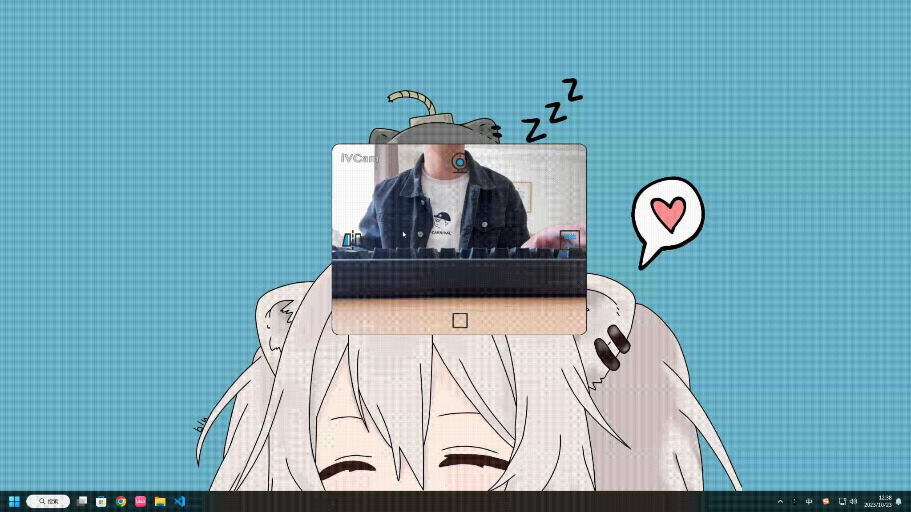

# camera

> 摄像头画面采集软件

## 特点

+ 多摄像头切换
+ 窗口置顶
+ 可切换画面显示比例
+ 镜像反转
+ 自由设置圆角

## 预览

## 下载地址

### windows

+ [exe-安装程序]('https://gitee.com/T-_-C/camera/releases/download/V1.0/%E6%91%84%E5%83%8F%E5%A4%B4%20Setup%201.0.0.exe)
+ [rar-解压即用](https://gitee.com/T-_-C/camera/releases/download/V1.0/%E6%91%84%E5%83%8F%E5%A4%B4-win-1.0.0.rar)

### MacOS

> 暂未测试mac平台

## 打包

> 根据需要自己打包

1. 克隆或下载代码到本地
2. 进入项目目录
3. 安装依赖包 `pnpm install`
4. 根据个人需求打包